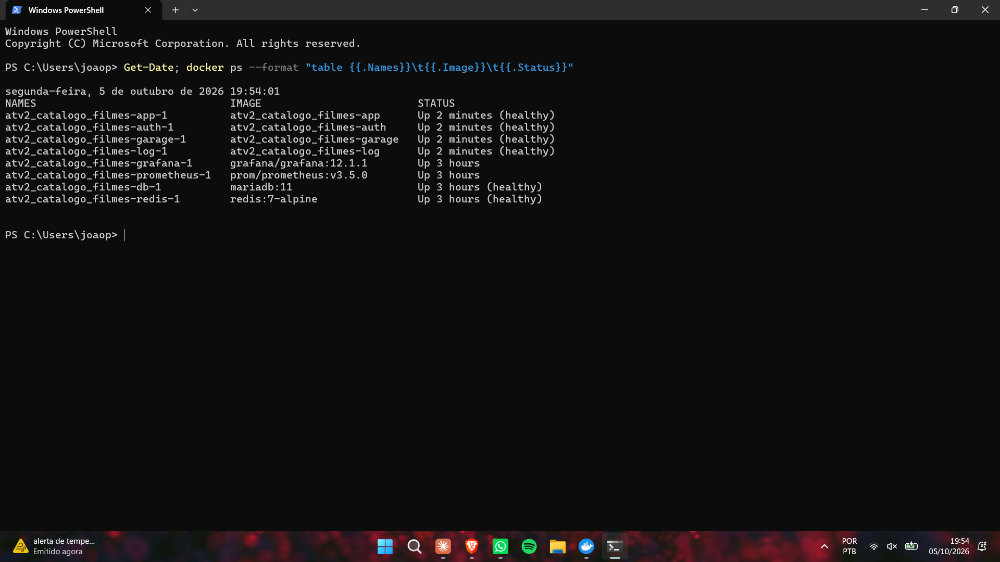
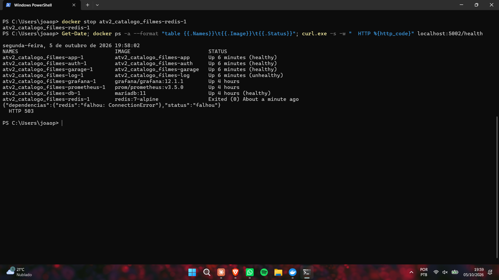
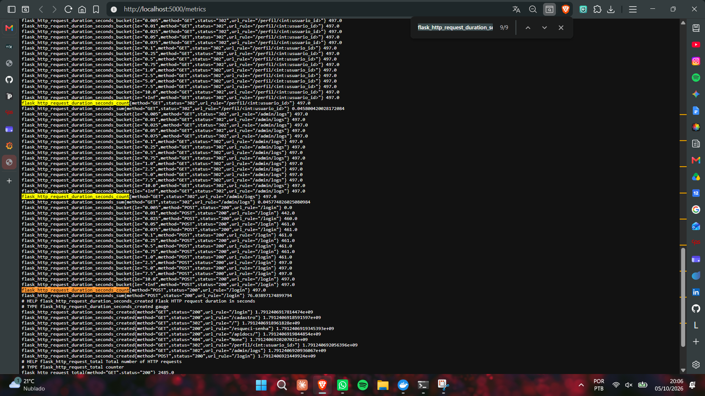
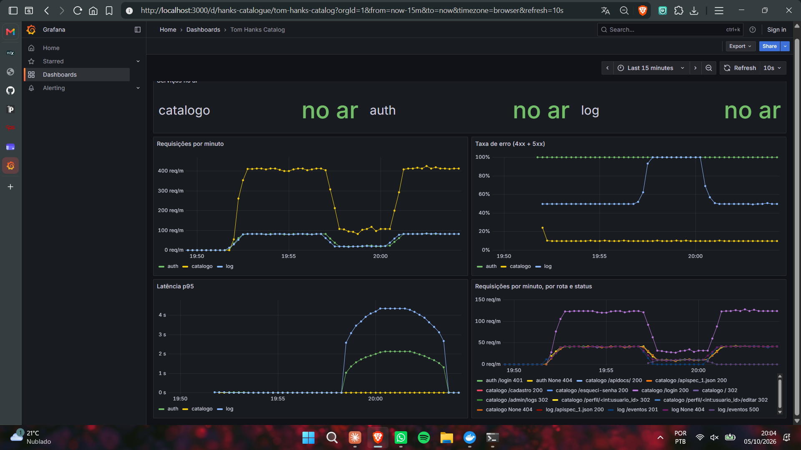

# 🎬 Tom Hanks Catalog

[](https://github.com/joao-alegre07/Hanks-catalogue/actions/workflows/ci-cd.yml)

Catálogo web para descobrir e acompanhar a filmografia de Tom Hanks. Busca os filmes ao vivo na API do TMDB e deixa cada usuário favoritar, comentar e montar um perfil com foto, bio e os filmes favoritos. Tem também um plano pago, o Premium, cobrado pelo Stripe (em modo de teste).

A aplicação é dividida em três serviços independentes: o **catálogo** (público), um **microsserviço de autenticação** (login, papéis de usuário e recuperação de senha) e um **microsserviço de logs** (auditoria, guardada num Redis) e um **object storage** ([Garage](https://garagehq.deuxfleurs.fr/), compatível com S3) pras fotos de perfil. Só o catálogo tem porta pública; o resto só é acessível pela rede interna do Docker.

## Funcionalidades

- **Cadastro e login** com senha com hash (nunca em texto puro), isolados num serviço próprio.
- **Catálogo paginado** (20 filmes por página), sempre buscado em tempo real na API do TMDB — pôster, título, sinopse e data de lançamento nunca ficam desatualizados.
- **Favoritos** por conta — cada usuário tem a sua lista, que aparece no perfil dele.
- **Comentários** visíveis pra qualquer usuário logado (como uma seção de reviews do filme), mas só o próprio autor — ou um admin — pode apagar um comentário.
- **Papéis de usuário** (`usuario` / `admin`) geridos pelo serviço de autenticação.
- **Recuperação de senha por e-mail**: link único, expira em 30 minutos e não pode ser reutilizado.
- **Perfil** com foto, bio e filmes favoritados, no estilo de rede social. A foto vai pro object storage; o banco guarda só a chave do arquivo.
- **Log de auditoria**: login, logout, favoritos, comentários, moderação e toda tentativa negada por permissão ficam registrados — só admin consulta.
- **Plano Premium** (R$ 9,90/mês) cobrado pelo Stripe: o cartão é digitado na página do Stripe e a confirmação do pagamento chega por webhook. Premium favorita sem limite (no gratuito são 5) e ganha um selo no perfil.

## Arquitetura

```
Navegador ── HTTPS ──> Catálogo (único ponto público)
                        │      │
                        │      │ rede interna do Docker
                        │      ▼
                        │   Serviço de autenticação ──> MariaDB
                        │      │
                        ▼      ▼
                     Serviço de logs (eventos)
                           │
                           ▼
                     Redis (Stream "auditoria")

Catálogo ──> Garage (bucket "fotos-perfil")   MariaDB guarda só a chave do objeto
Catálogo <─> Stripe (checkout + webhook)      MariaDB guarda só os IDs do Stripe
```

O catálogo é o único serviço com porta publicada. Login, cadastro, papéis e recuperação de senha
passam pelo catálogo, mas são resolvidos internamente pelo serviço de autenticação — que nunca é
alcançável de fora da rede Docker. Catálogo e auth mandam cada evento relevante pro serviço de
logs, que é o único que escreve no Redis.

## Stack

- **Backend**: Python + Flask (dois serviços separados)
- **Banco de dados**: MariaDB
- **Logs de auditoria**: Redis (Streams)
- **Object storage**: Garage (API S3), acessado com `boto3`
- **Dados de filmes**: [TMDB API](https://www.themoviedb.org/documentation/api)
- **E-mail**: Mailtrap (dev) / Brevo (produção)
- **Pagamentos**: [Stripe](https://stripe.com) (Checkout + webhooks), em modo de teste, com a biblioteca `stripe`
- **Documentação da API**: OpenAPI 3 + Swagger UI, via [flasgger](https://github.com/flasgger/flasgger)
- **Deploy**: Docker, servido via Gunicorn
- **CI/CD**: GitHub Actions, imagens no GHCR, deploy pela API do Portainer
- **Testes**: pytest (com `fakeredis` no log-service)
- **Observabilidade**: `/health` em cada serviço, HEALTHCHECK do Docker, `/metrics` com [prometheus-flask-exporter](https://github.com/rycus86/prometheus_flask_exporter), Prometheus + Grafana (local)

## Rodando localmente

Pré-requisitos: Docker, uma [chave de API do TMDB](https://developer.themoviedb.org) , uma [conta Mailtrap](https://mailtrap.io) e uma [conta Stripe](https://dashboard.stripe.com/register) em modo de teste (todas gratuitas).

```bash
git clone https://github.com/joao-alegre07/Hanks-catalogue.git
cd Hanks-catalogue
cp .env.example .env
# edite o .env com sua chave TMDB e as credenciais SMTP do Mailtrap
docker compose -f docker-compose.dev.yml up --build
```

Acesse `http://localhost:5000`. Esse compose sobe um MariaDB, um Redis e um Garage descartáveis junto, só pra desenvolvimento — nada de produção usa esses bancos.

As chaves do Garage (`S3_ACCESS_KEY`, `S3_SECRET_KEY`, `GARAGE_RPC_SECRET`) são inventadas por você mesmo — o `.env.example` mostra o comando pra gerar cada uma. No primeiro boot o Garage cria o bucket e a chave de acesso com esses valores.

## Estrutura do projeto

```
app/                      # catálogo
  __init__.py             # cria e configura a aplicação Flask
  auth.py                 # login/cadastro/esqueci-senha (chama o serviço auth)
  movies.py               # catálogo paginado, favoritar, comentar, /admin/logs
  perfil.py               # página de perfil, upload da foto, rota /fotos
  premium.py              # plano premium: checkout do Stripe e webhook
  storage.py              # envio e URLs assinadas do object storage (S3)
  auditoria.py            # envia eventos pro serviço de logs
  saude.py                # /health e /health/live
  db.py                   # conexão com o MariaDB
  tmdb.py                 # integração com a API do TMDB
  openapi.yml             # spec OpenAPI das rotas do catálogo
auth-service/             # serviço de autenticação (sem porta pública)
  app.py                  # cadastro, login, papéis, esqueci-senha
  db.py                   # conexão com o MariaDB
  mail.py                 # envio do e-mail de recuperação de senha
  auditoria.py            # envia eventos de login pro serviço de logs
log-service/              # serviço de logs (sem porta pública)
  app.py                  # grava (XADD) e lista (XREVRANGE) eventos no Redis
garage/                   # imagem do Garage com o garage.toml (sem segredos)
observabilidade/          # prometheus.yml e o painel do Grafana (provisionado sozinho)
tests/                    # testes do catálogo (auth-service/tests e log-service/tests pros outros dois)
.github/workflows/ci-cd.yml  # pipeline: testes -> imagens no GHCR -> deploy no Portainer
templates/                # páginas (login, cadastro, catálogo, perfil, premium, esqueci/resetar senha, logs)
static/                   # CSS
init.sql                  # schema do banco (usuarios com o plano, reset_tokens, favoritos, comentarios, perfis)
Dockerfile                # imagem do catálogo
auth-service/Dockerfile   # imagem do serviço de autenticação
log-service/Dockerfile    # imagem do serviço de logs
docker-compose.yml        # produção (Portainer) — catálogo, auth, logs, Redis e Garage
docker-compose.dev.yml    # desenvolvimento local
```

## Deploy

As imagens do catálogo, do auth, do log e do Garage (com o `garage.toml` copiado pra dentro) são
buildadas pelo GitHub Actions e publicadas no GHCR; o `docker-compose.yml` só puxa essas imagens,
junto com a imagem oficial do Redis — nada é buildado no servidor (ver [CI/CD](#cicd)). Os serviços de autenticação e de logs, o Redis e o Garage **não têm porta publicada pro host** — só são alcançáveis internamente, pela rede padrão do
projeto no Docker. Nenhuma credencial fica no
repositório — tudo é injetado como variável de ambiente em tempo de deploy (ver `.env.example`
pra lista completa: chave da TMDB, credenciais do MariaDB, credenciais SMTP, chaves do Garage e
do Stripe).

## Segurança

- Toda chamada à TMDB e ao MariaDB parte do backend — nada de chave ou senha exposta no HTML/JS que chega no navegador.
- Senhas de usuário armazenadas com hash (`werkzeug.security`).
- Links de redefinição de senha expiram em 30 minutos e não podem ser reutilizados (`reset_tokens.usado`).
- `.env` no `.gitignore`; só `.env.example` (sem valores reais) é versionado.
- Nenhum dado de cartão passa pelo sistema: o pagamento acontece na página do Stripe e o banco guarda só os IDs do cliente e da assinatura no Stripe.
- O webhook do Stripe só é aceito com assinatura válida (ver [Plano Premium](#plano-premium-stripe)).

## Permissões por papel

| Ação | `usuario` | `admin` |
|---|---|---|
| Ver catálogo, favoritar, comentar | ✅ | ✅ |
| Apagar o próprio comentário | ✅ | ✅ |
| Apagar comentário de qualquer usuário (moderação) | ❌ | ✅ |
| Consultar o log de auditoria (`/admin/logs`) | ❌ | ✅ |
| Ver o perfil de qualquer usuário | ✅ | ✅ |
| Editar o próprio perfil | ✅ | ✅ |
| Editar o perfil de outra pessoa | ❌ | ❌ |

A checagem acontece sempre no backend, nunca só escondendo um botão na tela: chamar o endpoint
`POST /comentarios/<id>/deletar` direto (por curl, Postman etc.) tentando apagar o comentário de
outra pessoa retorna `403` pra quem não é admin, independente do que a interface mostra.

## Padrão A ou B?

O `auth-service` hoje segue o **Padrão A (enforcement centralizado)**: antes de deixar alguém
apagar o comentário de outra pessoa, o catálogo faz uma chamada HTTP pro `auth-service`
(`GET /usuarios/<id>`) perguntando o papel *atual* daquele usuário — não confia em nada guardado
na sessão desde o login.

Se fosse pro Padrão B (claims num JWT assinado no login), o catálogo decodificaria o papel
localmente e decidiria sozinho, sem chamada de rede extra a cada tentativa de apagar um
comentário — mais rápido, mas com uma troca: se o papel de alguém mudasse (um admin virando
usuário comum, por exemplo), isso só teria efeito depois que o token expirasse e fosse renovado,
em vez de valer na hora, como acontece hoje.

## Log de auditoria

Cada ação relevante gera um evento que é enviado por HTTP pro `log-service`. Nenhum outro serviço
escreve direto no Redis — assim o log fica centralizado num lugar só, separado do código do catálogo.

| Ação | Quem registra | Quando |
|---|---|---|
| `login` / `login_falhou` | auth | tentativa de login (com e sem sucesso) |
| `logout` | catálogo | usuário sai |
| `favoritar` / `desfavoritar` | catálogo | clique no botão de favorito |
| `comentar` | catálogo | novo comentário |
| `apagar_comentario` | catálogo | autor apaga o próprio comentário |
| `moderar_comentario` | catálogo | admin apaga o comentário de outra pessoa |
| `editar_perfil` | catálogo | usuário salva bio e/ou foto |
| `acesso_negado` | catálogo | qualquer resposta `403` (rota e método ficam nos detalhes) |
| `checkout_premium` | catálogo | usuário abre o checkout do Stripe |
| `premium_ativado` / `premium_cancelado` | catálogo | webhook do Stripe confirmando pagamento / cancelamento |
| `webhook_recusado` | catálogo | chamada no webhook sem assinatura válida do Stripe |

Cada evento tem `usuario_id`, `acao` e `timestamp` (UTC, definido pelo `log-service` na hora em que
recebe o evento, pra que todos os serviços fiquem na mesma linha do tempo), além do `ip` de origem,
do `servico` que mandou e de um campo livre de `detalhes`.

O `acesso_negado` é registrado num handler de erro `403` do Flask, e não rota por rota — assim
qualquer tentativa barrada entra no log, inclusive em rotas que forem criadas depois.

### Por que Redis Streams

Os eventos ficam num Redis Stream (`XADD auditoria * ...`). O Stream já gera um ID por evento a
partir do horário do servidor, então a ordem cronológica vem de graça, e a consulta dos últimos N
eventos é um único `XREVRANGE auditoria + - COUNT N`. O Redis roda com `appendonly yes` e um volume
próprio, então os eventos sobrevivem a um restart do container.

Se o `log-service` estiver fora do ar, as ações do usuário continuam funcionando normalmente — o
envio do evento tem timeout curto e a falha é ignorada.

### Consulta

`GET /admin/logs` (link "Logs" no topo do catálogo, visível só pra admin) lista os últimos 50
eventos, do mais recente pro mais antigo; `?n=` muda a quantidade (até 500). A rota usa o mesmo
controle de acesso do resto do sistema: o catálogo pergunta o papel atual do usuário pro
`auth-service` e devolve `403` pra quem não é admin — e essa própria tentativa também vai pro log.

## Perfil e fotos

Cada usuário tem uma página de perfil (`/perfil/<id>`) com nome, foto, bio e os filmes que
favoritou. O nome do autor de cada comentário no catálogo leva pro perfil dele.

### Por que a foto não vai pro banco

A imagem vai pro **Garage**, um object storage compatível com S3 (usado no lugar do MinIO). No
MariaDB, a tabela `perfis` guarda só a bio e a **chave** do objeto — algo como
`perfis/6/3f2a...c1.png`. Cada upload gera uma chave nova (com um UUID) e o objeto antigo é apagado
depois que o banco já aponta pro novo.

O Garage roda como mais um serviço do compose, sem porta publicada. O `--single-node
--default-bucket` faz ele montar o layout de um nó só e criar o bucket e a chave de acesso no
primeiro boot, a partir de `S3_BUCKET`, `S3_ACCESS_KEY` e `S3_SECRET_KEY` — as mesmas variáveis que o
catálogo usa pra se conectar.

### Validação do upload

- **Tipo**: só JPG, PNG ou WebP. O backend confere os primeiros bytes do arquivo (a "assinatura" de
  cada formato), e não a extensão nem o `Content-Type` que o navegador manda, que dá pra forjar à
  vontade. Um `.png` que na verdade é texto é recusado.
- **Tamanho**: no máximo 2 MB por foto. Além disso o Flask corta qualquer requisição acima de 5 MB
  (`MAX_CONTENT_LENGTH`) antes mesmo de chegar na rota.
- **Bio**: até 280 caracteres.

### Exibição: URL pré-assinada

O bucket é **privado**. Na hora de montar a página de perfil, o catálogo gera uma URL pré-assinada
pra foto, válida por 10 minutos. Quem confere a assinatura e a validade é o próprio Garage: link
adulterado ou vencido volta `403`.

Como o Garage não tem porta pública, a URL assinada chega no navegador com o prefixo `/fotos` do
catálogo, e essa rota só repassa a requisição pro Garage exatamente como veio (mesmo caminho, mesma
query string com a assinatura). O catálogo não decide nada ali — só faz a ponte.

**Por que pré-assinada e não bucket público:**

- Com bucket público, qualquer um que descobrir a chave de um objeto consegue baixar o arquivo pra
  sempre, logado ou não. Em troca é mais simples: a URL é fixa, o navegador faz cache à vontade e
  não tem custo de gerar assinatura a cada página.
- Com URL pré-assinada, só quem abriu um perfil estando logado recebe um link, e esse link morre em
  10 minutos. Se alguém copiar o endereço da foto e mandar pra fora, ele para de funcionar logo. O
  preço é que a URL muda a cada carregamento da página (o cache do navegador ajuda menos) e o
  backend precisa gerar a assinatura sempre que monta o perfil.

Como a foto é de uma pessoa e o resto do sistema já exige login, controlar o acesso valeu mais do
que a simplicidade do bucket público.

### Quem pode editar

Qualquer usuário logado vê o perfil de qualquer outro, mas só edita o próprio. A rota
`POST /perfil/<id>/editar` compara o `<id>` da URL com o `usuario_id` guardado na sessão (definida
pelo servidor no login) e responde `403` se forem diferentes — nem admin edita o perfil de outra
pessoa. O id que vem na requisição nunca decide de quem é o perfil salvo; ele só é conferido. Essa
negativa passa pelo mesmo handler de `403` e entra no log como `acesso_negado`.

## Documentação da API (Swagger)

Os três serviços têm a API descrita em OpenAPI 3 e servem um Swagger UI em `/apidocs`, gerado pelo
flasgger. A spec em JSON fica em `/apispec_1.json` de cada um.

| Serviço | Swagger UI | Onde a spec está escrita |
|---|---|---|
| Catálogo | [joao-alegre-isw055.lapps.studio/apidocs](https://joao-alegre-isw055.lapps.studio/apidocs/) | [`app/openapi.yml`](app/openapi.yml) |
| auth-service | `http://localhost:5001/apidocs/` (só local) | docstring YAML em cada rota de [`auth-service/app.py`](auth-service/app.py) |
| log-service | `http://localhost:5002/apidocs/` (só local) | docstring YAML em cada rota de [`log-service/app.py`](log-service/app.py) |

Cada rota tem método, parâmetros, corpo esperado e todas as respostas possíveis com exemplo,
incluindo os erros (`400`, `401`, `403`, `404`, `409`, `413`, `503`, dependendo da rota).

O catálogo é o único com link público. O auth-service e o log-service continuam sem porta publicada
em produção, então o Swagger deles só abre rodando o `docker-compose.dev.yml`, que expõe as portas
5001 e 5002 só pra isso.

No catálogo a spec fica num arquivo separado em vez de docstring porque várias rotas atendem GET
(a página) e POST (o formulário) na mesma função. Essas rotas devolvem HTML e recebem formulário,
não JSON, e a spec descreve isso do jeito que é. Pro "Try it out", faça login no site antes (ou pelo
próprio `POST /login` no Swagger): o navegador manda o cookie de sessão junto e as rotas protegidas
respondem com os seus dados. Sem login elas redirecionam pra `/login`.

## CI/CD

Nenhum deploy é feito à mão. A cada push na `main`, o workflow
[`.github/workflows/ci-cd.yml`](.github/workflows/ci-cd.yml) roda três jobs em sequência — se um
falha, os seguintes nem começam:

```
push na main ──> testes ──> imagens (4 em paralelo) ──> deploy
                   │              │                       │
                 pytest     build + push no GHCR     IMAGE_TAG=sha-<commit>
                            sha-<commit> e latest    + pull e redeploy
                                                     no Portainer (ver pendência)
```

1. **testes** — roda o pytest dos três serviços. Os testes não dependem de nada externo: o catálogo
   tem as chamadas HTTP pro auth e pro log trocadas por respostas falsas, o auth-service usa uma
   conexão de banco falsa e o log-service usa o `fakeredis` no lugar do Redis. Cobrem login certo e
   errado, cadastro (com e-mail repetido, campos vazios e papel sempre `usuario`), o `403` ao editar o
   perfil de outra pessoa indo pro log, token de senha já usado, a ordem dos eventos de auditoria, o
   webhook do Stripe recusando assinatura inválida e o limite de favoritos do plano gratuito.
2. **imagens** — builda as quatro imagens e publica no GHCR com duas tags: `sha-<7 primeiros
   caracteres do commit>` e `latest`. Em pull request o build roda (pra pegar Dockerfile quebrado),
   mas nada é publicado.
3. **deploy** — chama a API do Portainer, troca a variável `IMAGE_TAG` da stack pela tag do commit e
   manda fazer *pull and redeploy*. Como o compose usa
   `ghcr.io/joao-alegre07/hanks-catalogue-app:${IMAGE_TAG:-latest}`, o container sobe com a imagem
   exata daquele commit — dá pra saber o que está em produção só olhando a tag no `docker ps`.

### Pendência: o deploy ainda é com um clique

O Portainer da disciplina (`portainer.lapps.studio`) fica atrás do Cloudflare, e o Cloudflare
responde `403` pras chamadas que saem dos runners do GitHub. A mesma chamada, com o mesmo token,
feita de um computador comum, responde `200` — então não é token nem permissão, é o caminho até o
servidor que está fechado pro GitHub.

Por isso o job de deploy tenta a API e, se receber outra coisa que não `200` ao ler a stack, não
derruba a execução: deixa um aviso e escreve no resumo da execução (aba Actions) a tag que acabou de
ser publicada. A atualização vira um clique no Portainer:

1. stack `hanks-catalogue` → **Environment variables** → `IMAGE_TAG` = `sha-<commit>` (a tag que
   aparece no resumo da execução);
2. **Pull and redeploy**.

O resto já é automático: testes, build, publicação das imagens com a tag do commit e o compose
apontando pra essa tag. Se o acesso dos runners ao Portainer for liberado (uma regra no Cloudflare
pra rota `/api` com token, por exemplo), o mesmo job passa a fazer o redeploy sozinho, sem mudar
nada no workflow.

| Imagem | |
|---|---|
| `ghcr.io/joao-alegre07/hanks-catalogue-app` | catálogo |
| `ghcr.io/joao-alegre07/hanks-catalogue-auth` | auth-service |
| `ghcr.io/joao-alegre07/hanks-catalogue-log` | log-service |
| `ghcr.io/joao-alegre07/hanks-catalogue-garage` | Garage com o `garage.toml` |

Execuções do pipeline: [aba Actions](https://github.com/joao-alegre07/Hanks-catalogue/actions/workflows/ci-cd.yml).
Execução verde usada na entrega: [run 37378493266](https://github.com/joao-alegre07/Hanks-catalogue/actions/runs/37378493266).

### Segredos

Nenhuma credencial aparece no workflow, nos Dockerfiles ou dentro das imagens (o `.dockerignore`
deixa o `.env` local de fora do build). Cada segredo fica num lugar só:

| Onde | O quê |
|---|---|
| GitHub → Settings → Secrets and variables → Actions | `PORTAINER_URL`, `PORTAINER_TOKEN` (access token criado no Portainer, em *My account*), `PORTAINER_STACK_ID` |
| Automático do GitHub Actions | `GITHUB_TOKEN`, usado só pra publicar no GHCR (permissão `packages: write` só no job de imagens) |
| Portainer → stack → Environment variables | senhas do banco, chave da TMDB, SMTP, chaves do Garage e o `IMAGE_TAG` (a tag do commit em produção) |

O job de deploy lê as variáveis atuais da stack, troca só o `IMAGE_TAG` e devolve o resto pro
Portainer do jeito que estava, sem imprimir nada no log. Os pacotes no GHCR são públicos (o
repositório também é), então o servidor puxa as imagens sem precisar de login no registry.

Se os três secrets do Portainer não estiverem configurados, o job de deploy cai no mesmo caminho da
pendência acima: avisa e deixa a tag no resumo da execução.

### Rodando os testes localmente

```bash
pip install -r requirements.txt -r auth-service/requirements.txt -r log-service/requirements.txt -r requirements-dev.txt
python -m pytest tests
cd auth-service && python -m pytest && cd ..
cd log-service && python -m pytest && cd ..
```

## Observabilidade

Logs de auditoria já existiam (o log-service). Aqui entram os outros dois sinais pra saber se o sistema
está de pé e como está se comportando sem precisar entrar no servidor: **health checks** e
**métricas**.

### `/health` em cada serviço

Cada serviço tem duas rotas:

- **`/health/live`** (*liveness*): só diz que o processo está vivo e respondendo. Sempre `200` se o
  Flask responder.
- **`/health`** (*readiness*): testa de verdade cada dependência que o serviço usa direto, com timeout
  de 2 segundos, e responde `503` se alguma falhar.

| Serviço | O que o `/health` testa |
|---|---|
| Catálogo | `SELECT 1` no MariaDB e `HeadBucket` no bucket do Garage |
| auth-service | `SELECT 1` no MariaDB |
| log-service | `PING` no Redis |

Com o Redis derrubado, `GET /health` no log-service responde `503`:

```json
{"dependencias": {"redis": "falhou: ConnectionError"}, "status": "falhou"}
```

O catálogo não testa o auth nem o log no `/health` dele — cada um já tem o próprio. Se o catálogo
também conferisse o log, o Redis caindo deixaria **dois** containers unhealthy em vez de um, e o
problema pareceria estar no lugar errado. Além disso o catálogo continua funcionando sem o
log-service (o evento de auditoria só se perde), então não faria sentido ele se declarar fora do ar
por causa disso.

### HEALTHCHECK no Docker

O `Dockerfile` do catálogo, do auth e do log tem um `HEALTHCHECK` que chama o `/health` a cada 15
segundos (com o `python` que já está na imagem, sem instalar `curl`). Três falhas seguidas e o
container fica `unhealthy`. O Redis e o Garage, que usam imagens prontas, têm o healthcheck no
compose (`redis-cli ping` e `garage status`). O compose também usa isso na subida: o log-service só
sobe depois do Redis estar `healthy`, e o catálogo só depois do Garage.

Derrubando o Redis (`docker stop <redis>`), o `/health` do log-service passa a responder `503` na
hora e em menos de um minuto o `docker ps` mostra o container `unhealthy` — enquanto o catálogo e o
auth continuam `healthy`. Voltando o Redis, o log-service volta pra `healthy` sozinho no próximo
check.

Tudo no ar:



Com o Redis parado, o log-service fica `unhealthy` sem ninguém mexer nele, e o `/health` dele
responde `503` dizendo qual dependência falhou:



O Docker sozinho (sem Swarm/Kubernetes) só **marca** o container como unhealthy, não reinicia nem
tira ele do tráfego. Num orquestrador, o `/health/live` seria o *liveness probe* (falhou → reinicia) e
o `/health` o *readiness probe* (falhou → para de mandar requisição, mas não reinicia: reiniciar o
log-service não traria o Redis de volta).

### `/metrics`

Os três serviços expõem `/metrics` no formato do Prometheus, via `prometheus-flask-exporter`. A
métrica principal é `flask_http_request_duration_seconds`, um histograma com as labels `method`,
`url_rule` (a rota) e `status` — o `_count` dele é a contagem de requisições por rota e status, e os
`_bucket` dão a latência.

```
flask_http_request_duration_seconds_count{method="GET",status="200",url_rule="/login"} 42.0
flask_http_request_duration_seconds_count{method="POST",status="403",url_rule="/perfil/<int:usuario_id>/editar"} 3.0
```

A label é a **regra** da rota (`/perfil/<int:usuario_id>`), não o caminho real (`/perfil/7`) — senão
cada id de usuário viraria uma série nova no Prometheus. O próprio `/health` fica fora da contagem,
pra o healthcheck do Docker (4 chamadas por minuto em cada serviço) não poluir os números.

O do catálogo é público: [joao-alegre-isw055.lapps.studio/metrics](https://joao-alegre-isw055.lapps.studio/metrics).



### Prometheus + Grafana

O `docker-compose.dev.yml` sobe também um Prometheus (coleta o `/metrics` dos três serviços a cada
15 s, config em [`observabilidade/prometheus.yml`](observabilidade/prometheus.yml)) e um Grafana com
o datasource e o painel **Tom Hanks Catalog** já provisionados — não precisa configurar nada na mão:

```bash
docker compose -f docker-compose.dev.yml up --build
```

- Grafana: `http://localhost:3000` (abre direto no painel, sem login)
- Prometheus: `http://localhost:9090`

| Painel | Consulta |
|---|---|
| Serviços no ar | `up` |
| Requisições por minuto | `sum by (job) (rate(flask_http_request_duration_seconds_count[1m])) * 60` |
| Taxa de erro (4xx + 5xx) | requisições com `status=~"4..\|5.."` ÷ total, por serviço |
| Latência p95 | `histogram_quantile(0.95, sum by (job, le) (rate(flask_http_request_duration_seconds_bucket[5m])))` |
| Requisições por rota e status | `sum by (job, url_rule, status) (rate(..._count[1m])) * 60` |

Prometheus e Grafana ficam só no compose de dev: no servidor da disciplina a stack tem uma porta
pública só (a do catálogo), e o Grafana precisaria de outra.

O painel abaixo é de um teste local, com um script chamando as rotas em loop (incluindo rotas
inexistentes e login com senha errada, por isso a taxa de erro alta). Entre 19:57 e 20:00 é o
mesmo Redis parado do print acima: o `/eventos` do log-service passa a responder `500`, a taxa de
erro dele vai pra 100%, a latência sobe, e tudo volta ao normal sozinho quando o Redis sobe de novo.



### Traces

O terceiro pilar seria o *tracing*: seguir uma requisição só (um login, por exemplo) passando pelo
catálogo → auth-service → log-service, com o tempo gasto em cada um. Ficou de fora; seria o próximo
passo, com OpenTelemetry.

## Plano Premium (Stripe)

O catálogo tem um plano pago, o **Premium (R$ 9,90/mês)**, cobrado pelo [Stripe](https://stripe.com)
em **modo de teste**: cartões de teste, nenhuma cobrança real.

| | Gratuito | Premium |
|---|---|---|
| Favoritos | até 5 | sem limite |
| Selo ★ Premium no perfil | ❌ | ✅ |

### Fluxo

```
1. "Assinar com Stripe"  ──>  POST /premium/assinar: o catálogo cria uma Checkout Session no Stripe
2. Catálogo ── 303 ──> página de pagamento do Stripe (o cartão é digitado lá)
3. Stripe ── redireciona ──> /premium?sucesso=1      só um aviso, não ativa nada
4. Stripe ── webhook ──> POST /stripe/webhook         chega depois, quando o Stripe mandar
5. Catálogo confere a assinatura ──> auth-service grava premium = 1 no MariaDB
```

O passo 3 não ativa o plano: qualquer um pode abrir `/premium?sucesso=1` na mão. Quem muda o plano é
só o webhook, que é assíncrono — por isso, logo depois de pagar, a página pode mostrar "a confirmação
chega em alguns segundos" até o evento chegar.

A Checkout Session é criada em modo `subscription` com o preço do `STRIPE_PRICE_ID` e o id do
usuário em `client_reference_id`, que volta no evento `checkout.session.completed`. O mesmo id vai
nos `metadata` da assinatura, porque o evento de cancelamento (`customer.subscription.deleted`) não
traz o `client_reference_id`.

### Validação do webhook

A rota `/stripe/webhook` é pública (o Stripe precisa alcançar), então qualquer um pode mandar um POST
pra ela dizendo que pagou. Cada chamada do Stripe vem com o cabeçalho `Stripe-Signature`
(`t=<horário>,v1=<assinatura>`): um HMAC-SHA256 do horário + corpo da requisição, feito com o segredo
do endpoint (`whsec_...`), que só o Stripe e o catálogo conhecem. O catálogo recalcula com
`stripe.WebhookSignature.verify_header` antes de ler qualquer coisa do corpo:

- assinatura ausente ou que não bate → `400`, e a tentativa vai pro log como `webhook_recusado`;
- horário com mais de 5 minutos → `400` também, então reenviar uma chamada legítima capturada não
  funciona;
- a verificação usa o corpo cru (`request.get_data()`): se o JSON fosse lido e serializado de novo, a
  assinatura deixaria de bater.

O Stripe pode mandar o mesmo evento mais de uma vez, e gravar `premium = 1` de novo não muda nada.
Se o auth-service estiver fora do ar quando o webhook chegar, a resposta é `503` e o Stripe tenta de
novo mais tarde — o pagamento não se perde.

### Onde o plano fica

O `premium` é uma coluna da tabela `usuarios`, ao lado do `role`, e quem escreve nela é o
auth-service (`PUT /usuarios/<id>/plano`, sem porta pública). Além dele o banco guarda só
`stripe_customer_id` e `stripe_subscription_id`. Número do cartão, CVV e validade nem chegam no
backend: ficam na página e nos servidores do Stripe.

### O benefício é checado no backend

Do mesmo jeito que o admin na moderação de comentários (Padrão A): pra favoritar um filme novo
acima do limite, o catálogo pergunta o plano **atual** pro auth-service, sem confiar na sessão.

- No limite, a interface desabilita o botão, mas isso é só aparência: tirar o `disabled` no DevTools
  ou chamar `POST /favoritar` direto devolve `403` e fica no log como `acesso_negado`.
- Desfavoritar é sempre liberado.
- Cancelando a assinatura, o `customer.subscription.deleted` volta o usuário pro gratuito na hora. Os
  favoritos que ele já tinha continuam lá, mas ele só adiciona outro quando ficar abaixo de 5.

### Configuração

| Variável | De onde vem |
|---|---|
| `STRIPE_SECRET_KEY` | Painel do Stripe → *Developers* → *API keys* (sempre a `sk_test_...`) |
| `STRIPE_PRICE_ID` | Preço mensal do produto "Plano Premium" (`price_...`) |
| `STRIPE_WEBHOOK_SECRET` | Segredo do endpoint de webhook (`whsec_...`) |

Em produção o endpoint cadastrado no Stripe é `https://joao-alegre-isw055.lapps.studio/stripe/webhook`,
com os eventos `checkout.session.completed` e `customer.subscription.deleted` no formato *snapshot*
(o webhook lê o objeto inteiro que vem no evento, sem buscar de novo na API). Num banco que já
existia, rodar o `init.sql` de novo cria as colunas novas (o `ALTER TABLE ... ADD COLUMN IF NOT
EXISTS` não mexe no que já está lá).

Rodando local, o Stripe não alcança o `localhost`, então o [Stripe CLI](https://docs.stripe.com/stripe-cli)
repassa os eventos e mostra o `whsec_...` pra pôr no `.env`:

```bash
stripe listen --forward-to localhost:5000/stripe/webhook
```

Cartão de teste: `4242 4242 4242 4242`, qualquer data futura e qualquer CVC.

## Relatório da P1

O relatório bimestral, com o quadro de entregas e a evidência de cada atividade, está em
[`docs/P1_ISW055_Joao_Alegre.pdf`](docs/P1_ISW055_Joao_Alegre.pdf).

---

Projeto para a aula do professor [@siriani](https://github.com/siriani).
